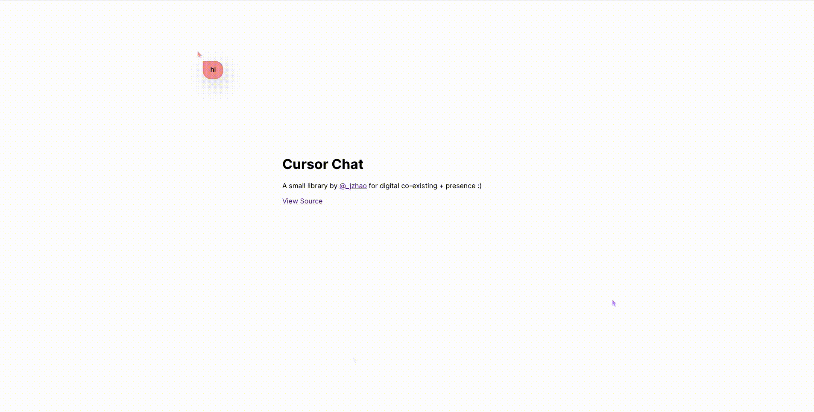

# cursor-chat
💬 lightweight (29.59kB) cursor chat à la Figma for digital co-existing + presence

As a warning, this library is for experimental purposes and should not be used in production (but very suitable for personal websites and playful experiments!).

Built on top of [yjs](https://github.com/yjs/yjs) and [perfect-cursors](https://github.com/steveruizok/perfect-cursors)

For a React version of this library, check out [y-presence](https://github.com/nimeshnayaju/y-presence).

## Demo


Press `/` to start chatting and `esc`

## Usage
Include this fragment in your HTML somewhere to include the base HTML divs, the compiled JavaScript bundle, and the styling.

```html
<div id="cursor-chat-layer">
  <input type="text" id="cursor-chat-box">
</div>
<script src="https://unpkg.com/cursor-chat"></script>
<link rel="stylesheet" type="text/css" href="https://unpkg.com/cursor-chat/dist/style.css"/>
```
